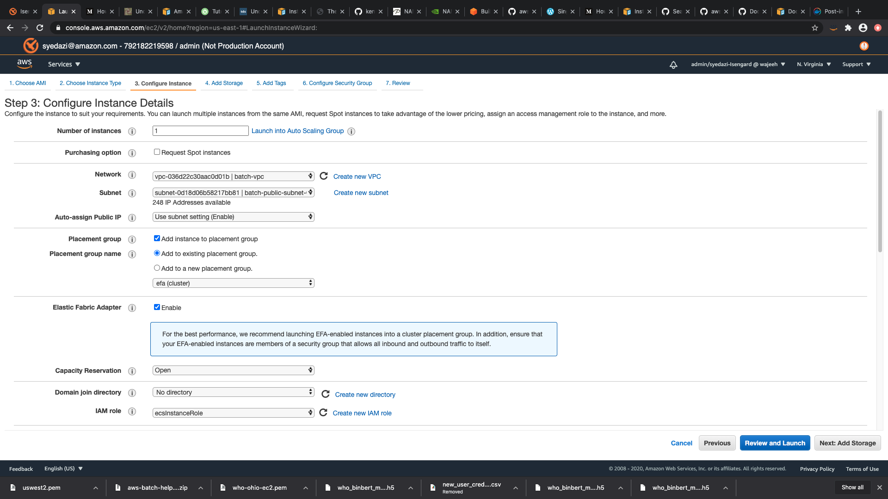
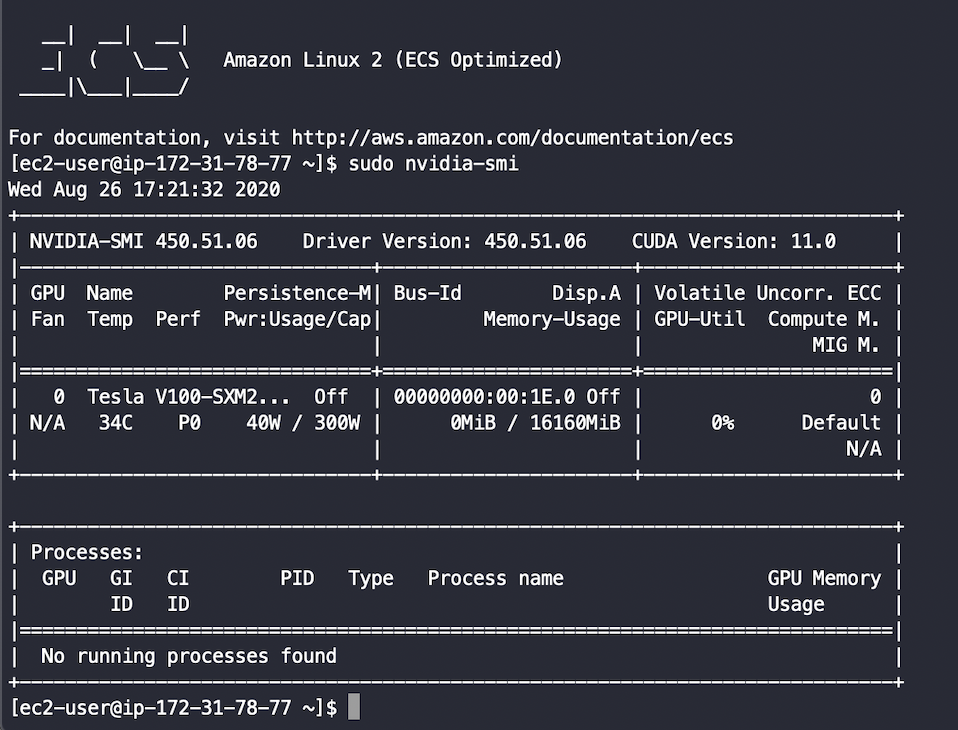

# Workshop for running Namd on on AWS Batch


* `POSTFIX=$(uuidgen --random | cut -d'-' -f1)`

## Prepare the Docker image

* Download the workshop example code:

    * `git clone https://github.com/swajahataziz/namd-aws-batch`
    * `namd-aws-batch`

* Create the docker image
    * `docker build --tag namd-docker:latest .`

* Create an ECR repository
    * `aws ecr create-repository --repository-name namd-docker-${POSTFIX}`
    * `ECR_REPOSITORY_URI=$(aws ecr describe-repositories --repository-names namd-docker-${POSTFIX} --output text --query 'repositories[0].[repositoryUri]')`

* Push the docker image to the repository:
    * Get login credentials: `$(aws ecr get-login --no-include-email --region us-east-1)`
    * `docker tag nextflow:latest $ECR_REPOSITORY_URI`
    * `docker push $ECR_REPOSITORY_URI`
    * Run the following command to get the image details:
    `aws ecr describe-images --repository-name namd-docker-${BUCKET_POSTFIX}`
    * You will need the following information to construct and use the image URI at a later stage
    	* registryId
    	* repositoryName
    	* imageTags
    * The image URI can be constructed using the format `<registryId>.dkr.ecr.<region>.amazonaws.com/<repositoryName>:<imageTag>`


## Configure IAM Policies & Roles

To allow AWS Batch to access the EC2 resources, we need to: 

* Create 3 new Policies:
	* **bucket-access-policy** to allow Batch to access the S3 bucket
	* **ebs-autoscale-policy** to allow the EC2 instance to autoscale the EBS

* and add 3 new Roles:
	* AWSBatchServiceRole
	* ecsInstanceRole
	* BatchJobRole
	
## Access Policies
### Bucket Access Policy

* To configure a new policy
	* In the IAM console, choose **Policies**, **Create policy**
	* Select Service -> S3
	* Select **All Actions**
	* Under **Resources** select **accesspoint** > Any
	* Under **Resources** select **job** > Any	
	* Under **Resources** > bucket, click **Add ARN**
		* Type in the name of the bucket you previously created
		* Click **Add**
	* Under **Resources** > object, click **Add ARN**
		* For **Bucket Name** type in the name of the bucket
		* Click **Object Name**, select **Any**
	* Click Review Policy
	* In the Review Policy Page, enter **bucket-access-policy** in the name field, and click Create Policy.

### EBS Autoscale Policy

* Go to the IAM Console
* Click on **Policies**
* Click on **Create Policy**
* Switch to the **JSON** tab
* Paste the following into the editor:
```json
{
    "Version": "2012-10-17",
    "Statement": {
        "Action": [
            "ec2:*Volume",
            "ec2:modifyInstanceAttribute",
            "ec2:describeVolumes"
        ],
        "Resource": "*",
        "Effect": "Allow"
    }
}
```
* Click **Review Policy**
* Name the policy **ebs-autoscale-policy**
* Click **Create Policy**

## IAM Roles
### Create a Batch Service Role

* In the IAM console, choose **Roles**, **Create New Role**.
* Under type of trusted entity, choose **AWS service** then **Batch**.
* Click **Next: Permissions**.
* On the Attach Policy page, the **AWSBatchServiceRole** will already be attached
* Click Next:Tags (adding tags is optional)
* Click **Next: Review**
* Set the Role Name to **AWSBatchServiceRole**, and choose Create Role.

### Create an EC2 Instance Role

This is a role that controls what AWS Resources EC2 instances launched by AWS Batch have access to. In this case, you will limit S3 access to just the bucket you created earlier.

* Go to the IAM Console
* Click on **Roles**
* Click on **Create Role**
* Select **AWS service** as the trusted entity
* Choose **EC2** from the larger services list
* Choose **EC2 - Allows EC2 instances to call AWS services on your behalf** as the use case.
* Click **Next: Permissions**
* Type **ContainerService** in the search field for policies
* Click the checkbox next to **AmazonEC2ContainerServiceforEC2Role** to attach the policy
* Type **S3** in the search field for policies
* Click the checkbox next to **AmazonS3ReadOnlyAccess** to attach the policy


**Note** :
Enabling Read-Only access to all S3 resources is required if you use publicly available datasets such as the ones available in the [AWS Registry of Open Datasets](https://registry.opendata.aws/).


* Type **bucket-access-policy** in the search field for policies
* Click the checkbox next to **bucket-access-policy** to attach the policy
* Type **ebs-autoscale-policy** in the search field for policies
* Click the checkbox next to **ebs-autoscale-policy** to attach the policy
* Click **Next: Tags**. (adding tags is optional)
* Click **Next: Review**
* Set the Role Name to **ecsInstanceRole**
* Click **Create role**

### Create a Job Role

This is a role used by individual Batch Jobs to specify permissions to AWS resources in addition to permissions allowed by the Instance Role above.

* Go to the IAM Console
* Click on **Roles**
* Click on **Create role**
* Select **AWS service** as the trusted entity
* Choose **Elastic Container Service** from the larger services list
* Choose **Elastic Container Service Task** as the use case.
* Click **Next: Permissions**

* Attach the following policies.
	* **bucket-access-policy**
	* **AmazonS3ReadOnlyAccess**
	* **nextflow-batch-access-policy**

* Click **Next: Tags**. (adding tags is optional)
* Click **Next: Review**
* Set the Role Name to **BatchJobRole**
* Click **Create Role**


## Setup Security and Placement Groups

### Prepare an EFA-enabled Security Group

An EFA requires a security group that allows all inbound and outbound traffic to and from the security group itself.

To create an EFA-enabled security group

1. Open the Amazon EC2 console at https://console.aws.amazon.com/ec2/
2. In the navigation pane, choose Security Groups and then choose Create Security Group.
3. In the Create Security Group window, do the following:

    For Security group name, enter a descriptive name for the security group, such as EFA-enabled security group.

    (Optional) For Description, enter a brief description of the security group.

    For VPC, select the VPC into which you intend to launch your EFA-enabled instances.

    Choose Create.

4. Select the security group that you created, and on the Description tab, copy the Group ID.
5. On the Inbound tab, do the following:

    Choose Edit.

    For Type, choose All traffic.

    For Source, choose Custom and paste the security group ID that you copied into the field.

    Choose Save.

6. On the Outbound tab, do the following:

    Choose Edit.

    For Type, choose All traffic.

    For Destination, choose Custom and paste the security group ID that you copied into the field.

    Choose Save.

### Create an EFA Placement Group

To ensure optimal physical locality of instances, we create a [placement group](https://docs.aws.amazon.com/AWSEC2/latest/WindowsGuide/placement-groups.html#placement-groups-cluster), with strategy `cluster`.

```bash
aws ec2 create-placement-group --group-name "efa" --strategy "cluster" --region [your_region]
```

## Setup an EFA enabled EC2 Image with ECS and Nvidia Docker
---------------------------------

### Start an EC2 Instance Docker

1. Go to EC2 Console → Instances → Launch Instance
2. Select “*Amazon Linux 2 AMI*" from the list
3. Under “Step 2: Choose an Instance Type”, select p3dn.24xlarge
4. Click 'Next: Configure Instance Details'
5. Under "Step 3: Configure Instance Details"
    a. Select the VPC you configured your security group with
    b. Select a public subnet
    c. Choose "Add Instance to Placement group" under "Placement group". Keep the default 'Add to existing placement group' option, click on the drop down and choose efa from the list of placement groups
    d. Under 'Elastic Fabric Adapter', click Enable
7. Under "IAM role" select "ecsInstanceRole" from the drop down.
8. Your screen should look similar to this:



9. Click "Next: Add Storage"
10. Change the size of the Root directory to 20GB and click "Next: Add Tags" -> "Next: Configure Security Groups"
11. Under "Step 6: Configure Security Group":
    a. Select "Select an existing security group"
    b. Select the security group you previously created from the drop down.
12. Click Review and Launch → Launch
13. Under ‘Select an existing key pair or create a new key pair’, 
    1. select Choose and existing pair if you already have an EC2 key pair. 
    2. Otherwise select ‘Create new key pair’ from the drop down box and enter a key name under ‘Key pair name’


14. Click on Launch Instances
15. Once the instance has started, use the instance’s public IP to SSH into the instance

### Install Docker & Amazon ECS Container Agent

1. Update the installed packages and package cache on your instance.
`sudo yum update -y`
2. Disable the docker Amazon Linux extra repository. The ecs Amazon Linux extra repository ships with its own version of Docker, so the docker extra must be disabled to avoid any potential future conflicts. This ensures that you are always using the Docker version that Amazon ECS intends for you to use with a particular version of the container agent.
`sudo amazon-linux-extras disable docker`
3. Install and enable the ecs Amazon Linux extra repository.
`sudo amazon-linux-extras install -y ecs; sudo systemctl enable --now ecs`
4. You can verify that the agent is running and see some information about your new container instance with the agent introspection API.
`curl -s http://localhost:51678/v1/metadata | python -mjson.tool`
5. Add the ec2-user to the docker group so you can execute Docker commands without using sudo.
`sudo usermod -a -G docker ec2-user`
5. Configure Docker to start on boot
`sudo systemctl enable docker`
6. Log out and log back in again to pick up the new docker group permissions. You can accomplish this by closing your current SSH terminal window and reconnecting to your instance in a new one. Your new SSH session will have the appropriate docker group permissions.
7. Verify that the ec2-user can run Docker commands without sudo.
`docker info`

### Install the EFA Software


1. Download the EFA software installation files. The software installation files are packaged into a compressed tarball (.tar.gz) file. To download the latest stable version, use the following command. 
`curl -O https://efa-installer.amazonaws.com/aws-efa-installer-latest.tar.gz`
2. Extract the files from the compressed .tar.gz file and navigate into the extracted directory.
`tar -xf aws-efa-installer-latest.tar.gz`
`cd aws-efa-installer`
3. Install the EFA software. 
`sudo ./efa_installer.sh -y`
4. Log out of the instance and then log back in.
5. Confirm that the EFA software components were successfully installed.
`fi_info -p efa`

## Configure ECS Image with NVidia Docker
-----------------------------------------------
To be able to run NVidia Docker containers, we need to create a machine image (AMI) based on one of the ECS-Optimised Amazon Linux AMIs and P3.2xlarge instance type, which has a NVidia Tesla V100 with 16GB memory. Please follow the following steps to create an ECS Image with NVidia Docker:


1. SSH into the server

`sudo su
 yum install -y gcc wget vim kernel-devel-$(uname -r)
 wget http://us.download.nvidia.com/tesla/450.51.06/NVIDIA-Linux-x86_64-450.51.06.run
 chmod +x NVIDIA-Linux-x86_64-450.51.06.run
 ./NVIDIA-Linux-x86_64-450.51.06.run #follow the installation instructions 
 reboot`

12. SSH into the server once the system has rebooted and run the following:

`sudo nvidia-smi`

13. It should produce a display similar to the following:



14.  Next we will install nvidia-docker2 and set it up as the default docker runtime. To install nvidia-docker2:

`distribution=$(. /etc/os-release;echo $ID$VERSION_ID)
 curl -s -L https://nvidia.github.io/nvidia-docker/$distribution/nvidia-docker.repo | \
 sudo tee /etc/yum.repos.d/nvidia-docker.repo
 sudo yum install -y nvidia-docker2 
 sudo pkill -SIGHUP dockerd`

 15. To set Nvidia docker as default runtime

 `sudo vim /etc/docker/daemon.json`

 16. append the following at the beginning of docker deamon config file, *“default-runtime”:”nvidia”.* The resulting document should look as follows:

 `{ *"default-runtime":"nvidia"*, 
"runtimes":{ "nvidia":{ "path":"/usr/bin/nvidia-container-runtime", "runtimeArgs":[] } }
}`

17. Restart docker

`sudo service docker start`

18. Reboot

`sudo reboot`

18. SSH back into the instance and test nvidia-smi with the nvidia cuda image

`docker run --rm nvidia/cuda nvidia-smi`

### Create the AMI

1. Go to the EC2 Console
2. Click on Instances and select the running instance. 
3. Click on Action → Image → Create Image
4. In Image name, enter namd-ami and click Create Image


## AWS Batch Resources

Next, we'll create all the necessary AWS Batch resources.

```bash
cd batch-resources/
```

First we'll create the compute environment, this defines the instance type, subnet and IAM role to be used. Edit the `<same-subnet-as-in-AMI>`, `<ami-id>` and `<account-id>` sections with the pertinent information. Then create the compute environment:


```bash
aws batch create-compute-environment --cli-input-json file://compute_environment.json
```

Next, we need a job queue to point to the compute environment:

```bash
aws batch create-job-queue --cli-input-json file://job_queue.json
```


### Job Definition

Now we need a job definition, this defines which docker image to use for the job. Edit the `<image-full-name>` and `<account-id>` sections with the pertinent information. You can get the image full name through the AWS Elastic Container Repository Console:

```bash
aws batch register-job-definition --cli-input-json file://job_definition.json
{
    "jobDefinitionArn": "arn:aws:batch:us-east-1:<account-id>:job-definition/EFA-MPI-JobDefinition:1",
    "jobDefinitionName": "EFA-MPI-JobDefinition",
    "revision": 1
}
```

### Submit a job

Finally we can submit a job!

```bash
aws batch submit-job --region ${AWS_REGION} --job-name example-mpi-job --job-queue EFA-Batch-JobQueue --job-definition EFA-MPI-JobDefinition
```


